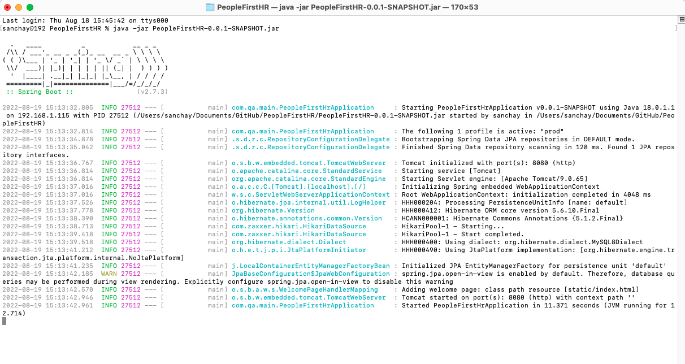
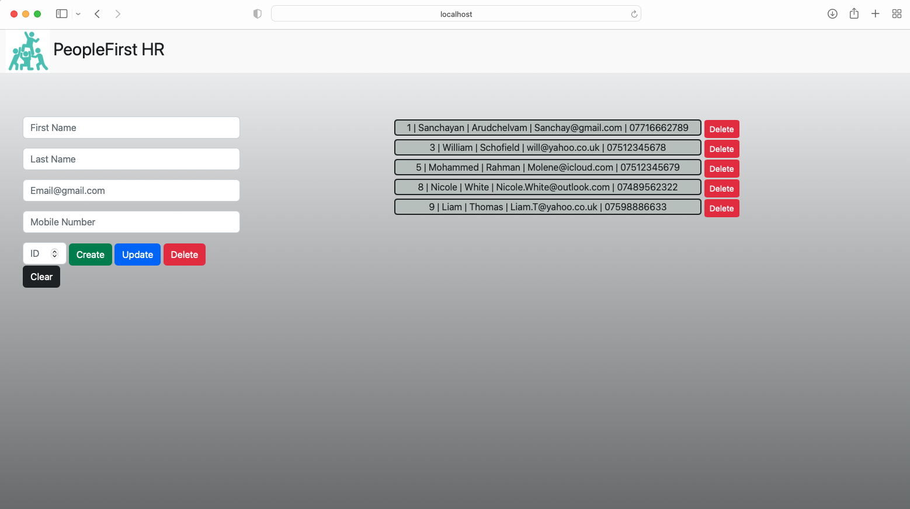
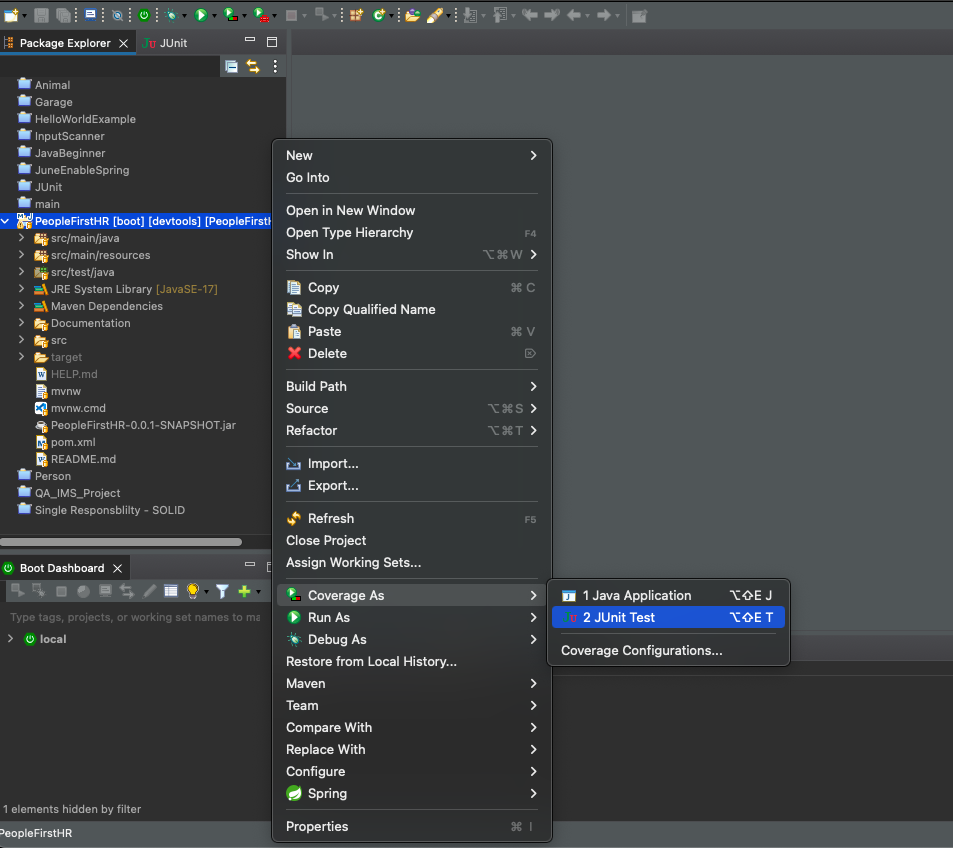
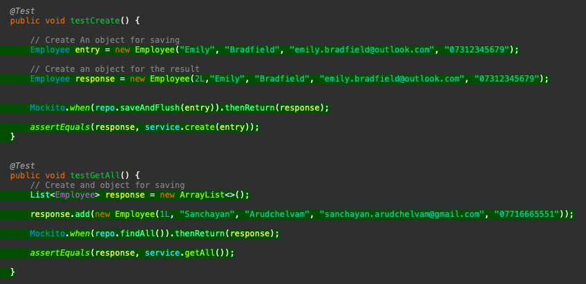
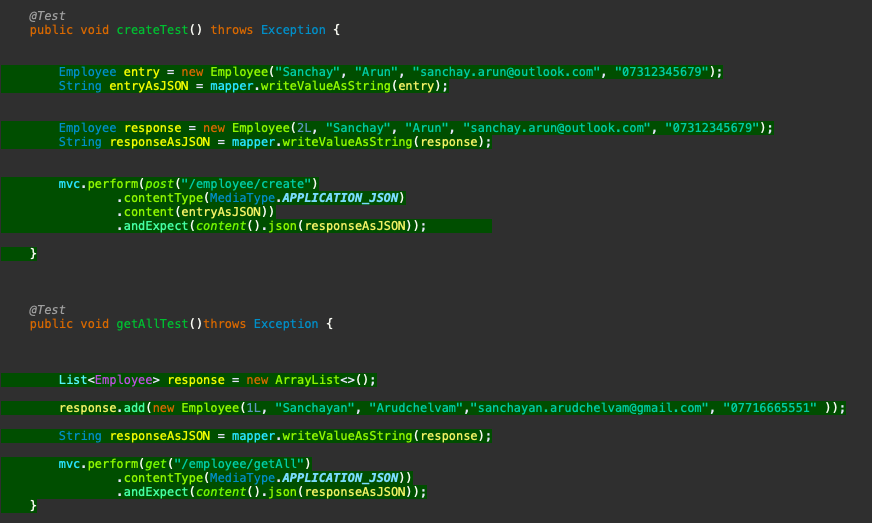

Coverge: 95.8%

# PeopleFirstHR
QA - Project

The PeoplFirst-HR employee management web application can keep track of current employees and their contact detils. The Web Application has full CRUD functionality.


## Getting Started

These instructions will get you a copy of the web application up and running on your local machine for development and testing purposes. See deployment for notes on how to deploy the project on a live system.

### Prerequisites for Deployment

Installations required to run web-application on local machine.

```
- Install Java SE Development Kit 
  https://www.oracle.com/java/technologies/downloads/#java17
  
- Install MySQL Community with Workbench to create and access databases.
  https://dev.mysql.com/downloads/installer/  
```

### Prerequisites for Development & Testing

Installation Requirements for Development & Testing

```
- Install Git Bash to push updates from your local respository to the Remote Github repository
  https://git-scm.com/downloads
  
- Install Eclipse IDE for Java
  https://www.eclipse.org/downloads/
  
- Install Spring Boot Framework within Eclipse IDE
  https://www.eclipse.org/community/eclipse_newsletter/2018/february/springboot.php
  
- Install Apache Maven for testing. Two dependencies are required; JUnit and Mockito.
  https://maven.apache.org/download.cgi

- Install VS code for Front-end development
  https://code.visualstudio.com/docs/setup/setup-overview
```

### Installing

Steps to download and run the web application on local machine after required prerequisites have been installed.

 #### Step one 
 Open a terminal console in the desired directory.
 Clone the repository using the ssh url of this repository.
 Enter the following command in to the terminal: git clone git@github.com:sanchayarun/PeopleFirstHR.git
  ```
  git clone git@github.com:sanchayarun/PeopleFirstHR.git
  ```
 #### Step two 
 Open a new terminal console in the root folder of cloned repository.
 Enter the following command in to the terminal: java -jar PeopleFirstHR-0.0.1-SNAPSHOT.jar
 The application shouldrun in the terminallike below.
  ```
  java -jar PeopleFirstHR-0.0.1-SNAPSHOT.jar
  ```

 #### Step three 
 The API is running in the background.
 Open a browser and type the following url: http://localhost:8080/index.html
 It should take you to the landing page
  ```
  http://localhost:8080/index.html
  ```
  
  
  ## Running the tests

To run the tests open the project in Eclipse
Right click on the project folder PeopleFirstHR, then click Coverage As JUnit test. This will run all the tests done in the project.



### Unit Tests 

Unit tests are performed on the smaller and individual units of the application such as classes and methods are tested for proper operation.

These unit tests were done on EmployeeService



### Integration Tests 
Integration tests are tests that involves disk access, application service and/or frameworks from the target application. So multiple components of the application are being used for the test and to check if they are all interacting properly.

These integration tests were done on EmployeeController



## Built With

* [Maven](https://maven.apache.org/) - Dependency Management

## Versioning

We use [GitHub](https://github.com) for versioning.

## Authors
* **Sanchayan Arudchelvam** - *Web Application* - [SanchayArun](https://github.com/sanchayarun)


## License

This project is licensed under the MIT license - see the [LICENSE.md](LICENSE.md) file for details 

*For help in [Choosing a license](https://choosealicense.com/)*

## Acknowledgments

* Jordan Benbelaid - Trainer 
* Anoush Lowton - Trainer

